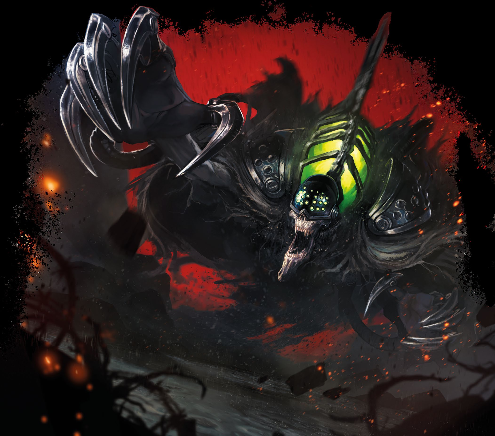

# Aparición Mecánika

*Autómata Grande (necrotécniko), caótico malvado*

___
- **Clase de Armadura** 14
- **Puntos de Golpe** 65 (10d10 + 10)
- **Velocidad** 30 pies

___
| FUE | DES | CON | INT | SAB | CAR |
|:---:|:---:|:---:|:---:|:---:|:---:|
|18 (+4)|14 (+2)|12 (+1)|10 (+0)|10 (+0)|14 (+2)|

___
- **Resistencia a daño** ácido, fuego, relámpago, trueno; contundente, cortante y perforante de ataques no mágicos
- **Inmunidad a daño** frío, necrótico, veneno
- **Inmunidad a estados** agarrado, apresado, asustado, cansancio, derribado, envenenado, hechizado, paralizado, petrificado
- **Sentidos** visión en la oscuridad 60 pies, Percepción pasiva 10
- **Idiomas** —
- **Desafío** 5 (1.800 PX)

___
***Movimiento Incorpóreo.*** La aparición puede moverse a través de otras criaturas y objetos como si fueran terreno difícil. Si termina su turno dentro de un objeto, sufrirá 5 (1d10) de daño de fuerza

***Resistencia a Expulsión.*** La aparición tiene ventaja en las tiradas de salvación contra efectos que expulsan muertos vivientes. Poco se sabe sobre estas visiones de pesadilla llamadas apariciones mecánikas, aunque sin duda son alguna retorcida anormalidad de naturaleza mecánika. Algunos eruditos especulan que estos autómatas son los fantasmas resentidos de los mecánikos arcanos o los sacerdotes caídos de Cyriss; otros sostienen que son conjuradores de guerra fallecidos. Sea cual fuere su origen, su aullido metálico puede helar la sangre del guerrero más firme. Después de un encontronazo cercano con una aparición mecánika hace algunos años, puedo considerarme afortunado de haber tenido la oportunidad de observar a una criatura así. Sin embargo, debo decir que nunca volveré a sentirme tan seguro como antes en presencia de un siervo de guerra. —Viktor Pendrake

### Acciones

***Ataque múltiple.***

***Fusión con la máquina (recarga 5–6).***

___
> *Sea cual fuere su origen, su aullido metálico puede helar la sangre del guerrero más firme. Después de un encontronazo cercano con una aparición mecánika hace algunos años, puedo considerarme afortunado de haber tenido la oportunidad de observar a una criatura así. Sin embargo, debo decir que nunca volveré a sentirme tan seguro como antes en presencia de un siervo de guerra.*
>
> —Viktor Pendrake

---
[← Volver al Índice](index.md)
