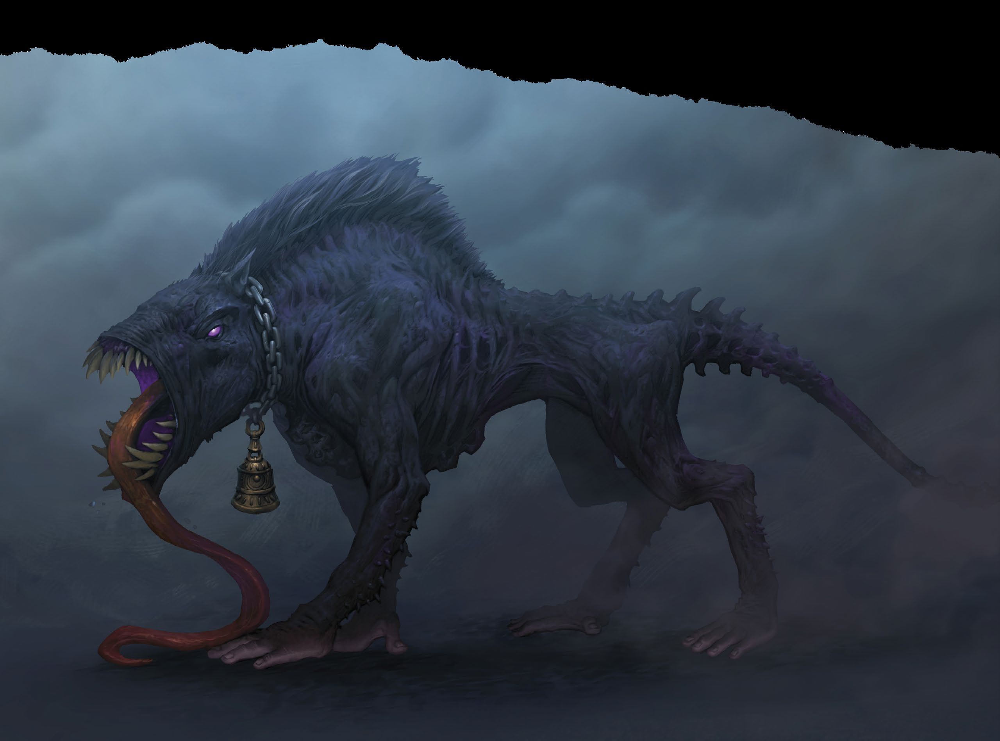

# Sabuesanguinario

*Feérico Grande (funesto), legal malvado*

___
- **Clase de Armadura** 14
- **Puntos de Golpe** 127 (17d10 + 34)
- **Velocidad** 40 pies

___
| FUE | DES | CON | INT | SAB | CAR |
|:---:|:---:|:---:|:---:|:---:|:---:|
|16 (+3)|18 (+4)|14 (+2)|5 (−3)|10 (+0)|7 (−2)|

___
- **Tiradas de salvación** Des +7
- **Habilidades** Percepción +3, Sigilo +7
- **Inmunidad a estados** asustado, cansancio
- **Sentidos** visión en la oscuridad 120 pies, Percepción pasiva 13
- **Idiomas** —
- **Desafío** 6 (2.300 PX)

___
***Movimiento Incorpóreo.*** El sabuesanguinario puede moverse a través de otras criaturas y objetos como si fueran terreno difícil. Si termina su turno dentro de un objeto, sufrirá 5 (1d10) de daño de fuerza

***Olfato Agudo.*** El sabuesanguinario tiene ventaja en las pruebas de Sabiduría (Percepción) que dependan del olfato.

***Esconderse en las Sombras.*** Mientras se encuentra bajo luz tenue o en oscuridad, el sabuesanguinario puede Esconderse usando una acción adicional.

### Acciones

***Ataque múltiple.***

___
---
[← Volver al Índice](../index.md)
