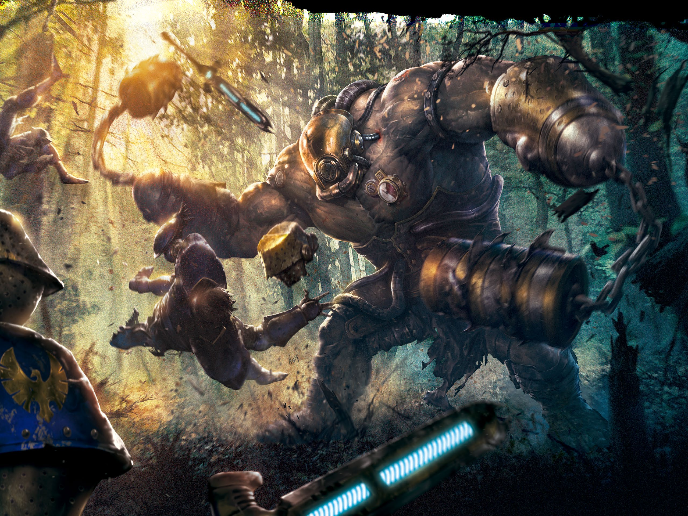

# Rompecascos

*Bestia Enorme, sin alineamiento*

___
- **Clase de Armadura** 17 (armadura natural)
- **Puntos de Golpe** 190 (20d12 + 60)
- **Velocidad** nadar 60 pies.

___
| FUE | DES | CON | INT | SAB | CAR |
|:---:|:---:|:---:|:---:|:---:|:---:|
|22 (+6)|16 (+3)|16 (+3)|3 (−4)|14 (+2)|8 (−1)|

___
- **Habilidades** Percepción +5, Sigilo +6
- **Sentidos** visión ciega 120 pies, Percepción pasiva 15
- **Idiomas** —
- **Desafío** 8 (3.900 PX)

___
***Oído Agudo.*** El rompecascos tiene ventaja en las pruebas de Sabiduría (Percepción) que dependen del oído.

***Azote Espinal.*** Cuando el rompecascos se mueva y pase a 10 pies o menos de una criatura, embarcación o estructura, esta es destrozada por sus enormes espinas dorsales. Cada nave y estructura afectada sufre 55 (10d10) de daño cortante, y cada criatura afectada debe superar una tirada de salvación de Destreza CD 16 o recibirá 27 (5d10) de daño cortante. Este atributo solo puede dañar a cada objetivo afectado una vez por turno. Además, una criatura que toque al rompecascos o le impacte con un ataque cuerpo a cuerpo mientras está a 5 pies o menos de él, sufre 5 (1d10) de daño cortante.

***Respirar bajo el Agua.*** El rompecascos solo puede respirar bajo el agua.

### Acciones

***Ataque múltiple.***

___
---
[← Volver al Índice](index.md)
