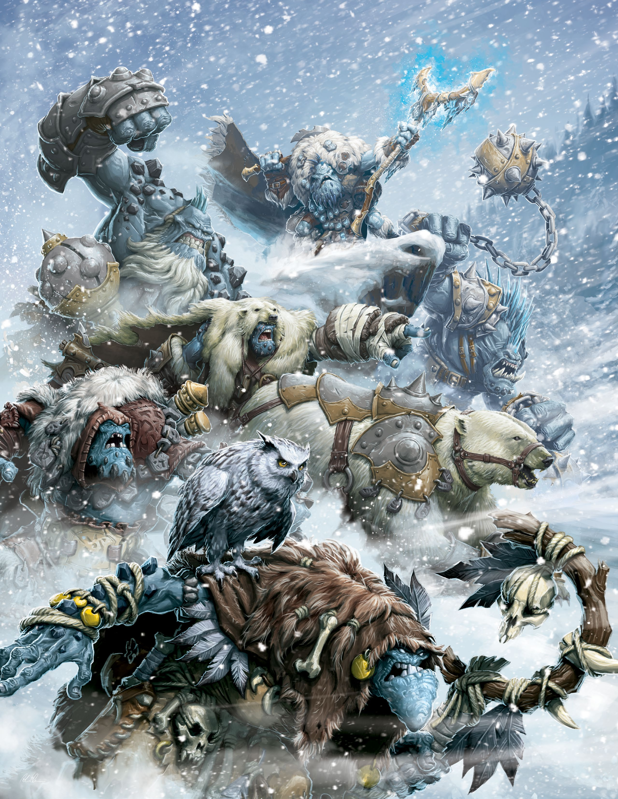

# Thrullg

*Aberración Grande, sin alineamiento*

___
- **Clase de Armadura** 13 (armadura natural)
- **Puntos de Golpe** 85 (10d10 + 30)
- **Velocidad** 40 pies, trepar 20 pies, nadar 30 pies

___
| FUE | DES | CON | INT | SAB | CAR |
|:---:|:---:|:---:|:---:|:---:|:---:|
|18 (+4)|13 (+1)|17 (+3)|10 (+0)|8 (−1)|7 (−2)|

___
- **Habilidades** Atletismo +6, Sigilo +3
- **Sentidos** visión en la oscuridad 60 pies, Percepción pasiva 9
- **Idiomas** —
- **Desafío** 4 (1.100 PX)

___
***Anfibio.*** El thrullg puede respirar tanto dentro del agua como fuera de ella.

***Camuflarse bajo el Agua.*** El thrullg tiene ventaja en las pruebas de Destreza (Sigilo) realizadas bajo el agua.

***Resistencia Mágica.*** El thrullg tiene ventaja en las tiradas de salvación contra conjuros y otros efectos mágicos.

***Sentir la Magia.*** El thrullg puede señalar la ubicación de los objetos mágicos y lanzamiento de conjuros a 100 pies o menos de él.

### Acciones

***Ataque múltiple.***

___
> *Y, de ser así, ¿de qué se alimentaban los thrullgs antes de la llegada de la mecánika o del mismo don de la magia? Solo puedo postular que quizás en el pasado fue una criatura muy diferente a la que es actualmente. El thrullg es digno de estudio, aunque solo sea porque apunta a una progresión del mundo natural hacia una adaptación a veces alucinante.*
>
> —Viktor Pendrake

---
[← Volver al Índice](index.md)
